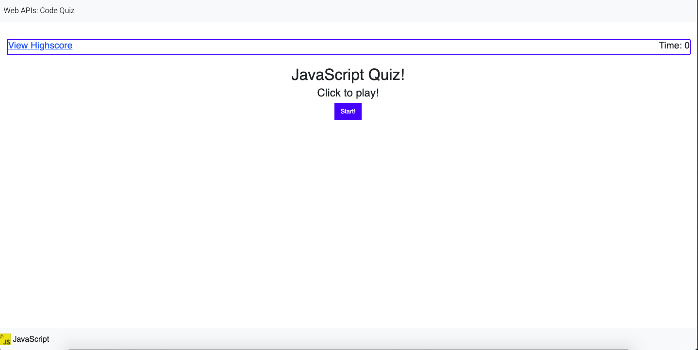

# Web-APIs-04
In this assignment I was able to work on a creative Quiz using Html, Css and JavaScript.

To be able to complete the quiz, I had to first creative the web page in which consisted with Html and Css. Althoug, the page looks a bit simple, I was able to be creative and practice on my creativity and quickness to get the design of a page with more frequency and effectiveness. 

Working with JavaScript in order to make the quiz alive was something new and different. I was able to completed this part of the assignment by simply googling every details to come up with the best possible way to get it done. 

Here is the link to my Web.
https://malcan09.github.io/Web-APIs-04/.

